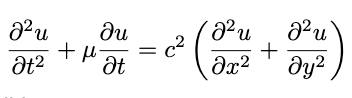

# Wave Equation Numerical Solver

This project provides a MATLAB script to numerically solve the wave equation in a square 2D domain. The solver is capable of handling both Dirichlet and Neumann boundary conditions, along with arbitrary initial conditions. Additionally, it supports optional features such as forcing a sinus wave motion in the center of the domain and introducing an optional energy friction term. This script uses the central finite differences scheme.

## Partial Differential Equation (PDE)
The wave equation being solved by this script is a is given by:

where:
- `u(x, y, t)` is the wave function,
- `c` is the wave propagation speed,
- `µ` is a parameter determining the energy loss due to friction,
- `x` and `y` are spatial coordinates,
- `t` is time,
- `α₁`, `α₂`, `α₃`, `α₄` are real functions determining the eventual Dirichlet boundary condition,
- `f₁`, `f₂`, `f₃`, `f₄` are real functions determining the eventual Neumann boundary condition,
- `g` and `v` are real functions determining the initial condition.
## Usage

To use the wave equation solver, follow these steps:

1. Open the MATLAB script `WaveEquationNumerical.m` in a MATLAB environment.

2. Adjust the parameters in the script to fit your specific problem:
   - `L_x`: Length of the domain in the x-direction.
   - `L_y`: Length of the domain in the y-direction.
   - `T`: Total simulation time.
   - `N_x`: Number of spatial points in the x-direction.
   - `N_y`: Number of spatial points in the y-direction.
   - `N_t`: Number of time steps.
   - `c`: The wave speed.
   - `stability_constant`: Has to be smaller than 1. This can be changed by modifying the number of spatial points, the size of the domain, the number of time steps, or the wave speed.
   - `µ`: Parameter determining the energy loss due to friction.
   - Any additional changes to the boundary- and initial- conditions.
3. Run the first section of the script to compute the numerical solution to the wave equation.
4. Run the second section in order to visualize the solution in 3D.

## Results

The first section of the script generates a numerical solution to the wave equation.

## Visualization

The second section of the script generates a 3D plot of the wave evolution over time. An example of this can be seen below.

## Additional Notes

- Optional features, such as forcing a wave motion on the edge of the domain, are demonstrated in the script and can be modified or disabled as required.
